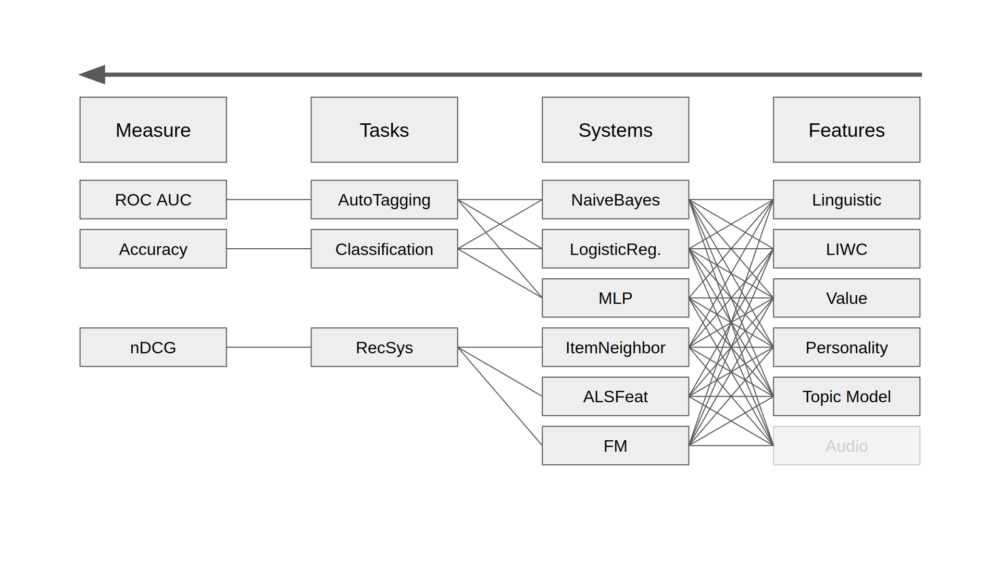

```{r setup, results=FALSE}
knitr::opts_chunk$set(echo = TRUE)

library(tidyverse)
library(purrr)
library(ggplot2)
library(sjPlot)
library(cowplot)
library(lme4)
library(lmerTest)
library(boot)
library(gplots)
library(performance)
library(see)
library(here)
library(Hmisc)
library(effects)
library(viridis)
```


```{r dataset, results=FALSE}
df <- read.csv(here("data_", "lyrics_runs.csv"))
test_df <- df %>% filter(personality=="True"|topic=="True"|linguistic=="True"|liwc=="True"|value=="True"|audio=="True")

#convert "True" and "False" to 1 and 0 respectively, for analysis
TrueFalseToNumbers <- function(x, print=TRUE){
  x <- as.character(x)
  x <- replace(x, x=="True", "1")
  x <- replace(x, x=="False", "0")
  x <- as.numeric(x)
  return(x)
}

test_df$personality <- TrueFalseToNumbers(test_df$personality)
test_df$liwc <- TrueFalseToNumbers(test_df$liwc)
test_df$topic <- TrueFalseToNumbers(test_df$topic)
test_df$value <- TrueFalseToNumbers(test_df$value)
test_df$linguistic <- TrueFalseToNumbers(test_df$linguistic)
test_df$audio <- TrueFalseToNumbers(test_df$audio)

test_df$feature_number <- (test_df$personality+test_df$topic+test_df$linguistic+test_df$liwc+test_df$value+test_df$audio)

test_df$dimension_number <- (test_df$personality*5+test_df$topic*25+test_df$linguistic*9+test_df$liwc*72+test_df$value*49+test_df$audio*240)

lapply(test_df[,c('personality', 'topic', 'value', 'audio', 'linguistic', 'liwc')], as.factor)
```

```{r, results=FALSE}
#standardize score within task
test_df <- 
  test_df %>%
  group_by(task) %>%
  mutate(score_z = scale(score))

#log
test_df <-
  test_df %>%
  mutate(score_log = logit(score))
```


This dataset is the result of a series of runs of various system setups on three MIR tasks. The response variable, "score", is the output of each run where a higher score was more successful. The "task" column is a nominal variable representing each of the three tasks: genre classification, autotagging, or recommender system. Three systems were used for each task, and are in the "models" column as a nominal variable. 

The columns "personality", "liwc", "topic", "value", "linguistic" and "audio" represent the feature sets used in The values in these columns are either "True" or "False" depending on whether or not they were used in a given trial run. There were 5 trials run for each configuration. 


```{r head}
head(df)
```


Histograms showing raw score, standardized score, and logit score within each system:
```{r}
ggplot(test_df, aes(x = score, color = model, fill=model)) +
  geom_histogram(bins = 1000) +
  facet_wrap(~model)

ggplot(test_df, aes(x = score_z, color = model, fill=model)) +
  geom_histogram(bins = 1000) +
  facet_wrap(~model)

ggplot(test_df, aes(x = score_log, color = model, fill=model)) +
  geom_histogram(bins = 1000) +
  facet_wrap(~model)
```

Histograms showing raw score, standardized score, and logit score within each task:
```{r, echo=FALSE}
ggplot(test_df, aes(x = score, color = task, fill=task)) +
  geom_histogram(bins = 50) +
  facet_wrap(~task)

ggplot(test_df, aes(x = score_z, color = task, fill=task)) +
  geom_histogram(bins = 50) +
  facet_wrap(~task)

ggplot(test_df, aes(x = score_log, color = task, fill=task)) +
  geom_histogram(bins = 50) +
  facet_wrap(~task)
```
95% CI for each model, within each task, for the raw score, standardized score, and logit score respectively:
```{r}
alpha <- .05
ci_score <- 
  test_df %>% 
  group_by(task, model) %>%
  dplyr::summarize(mean = mean(score),
                   uci_score = mean(score) - qt(1-alpha/2, (n()-1))*sd(score)/sqrt(n()),
                   lci_score = mean(score) + qt(1-alpha/2, (n()-1))*sd(score)/sqrt(n()))

ci_score %>%
  ggplot(aes(x = task, y =mean, fill = model)) +
  geom_bar(stat = "identity", position = "dodge") +
  geom_errorbar(aes(ymin = lci_score, ymax = uci_score), position = "dodge")

alpha <- .05
ci_score_z <- 
  test_df %>% 
  group_by(task, model) %>%
  dplyr::summarize(mean = mean(score_z),
                   uci_score_z = mean(score_z) - qt(1-alpha/2, (n()-1))*sd(score_z)/sqrt(n()),
                   lci_score_z = mean(score_z) + qt(1-alpha/2, (n()-1))*sd(score_z)/sqrt(n()))

ci_score_z %>%
  ggplot(aes(x = task, y =mean, fill = model)) +
  geom_bar(stat = "identity", position = "dodge") +
  geom_errorbar(aes(ymin = lci_score_z, ymax = uci_score_z), position = "dodge")

alpha <- .05
ci_score_log <- 
  test_df %>% 
  group_by(task, model) %>%
  dplyr::summarize(mean = mean(score_log),
                   uci_score_log = mean(score_log) - qt(1-alpha/2, (n()-1))*sd(score_log)/sqrt(n()),
                   lci_score_log = mean(score_log) + qt(1-alpha/2, (n()-1))*sd(score_log)/sqrt(n()))

ci_score_log %>%
  ggplot(aes(x = task, y =mean, fill = model)) +
  geom_bar(stat = "identity", position = "dodge") +
  geom_errorbar(aes(ymin = lci_score_log, ymax = uci_score_log), position = "dodge")

```

```{r, results=FALSE}
load(here("models", "stan8.4.rda"))
load(here("models", "stan8.3.rda"))
load(here("models", "stan8.2.rda"))
load(here("models", "stan8.1.rda"))
load(here("models", "stan8.rda"))
load(here("models", "stan7.2.rda"))

model_fits_stan =list(stan8.4, stan8.3, stan8.2, stan8.1, stan8, stan7.2)

load(here("models", "all_params_stan.rda"))

model_fits_all = model_fits_stan %>%
  tibble() %>%
  rename("model" = ".") %>%
  mutate(model_num = row_number(),
         AIC = map_dbl(model, AIC),
         BIC = map_dbl(model, BIC)) %>%
  select(-model)

(models.sca = all_params %>%
    select(model_num, term, estimate) %>%
    spread(term, estimate) %>%
    left_join(., model_fits_all) %>%
    arrange(AIC)%>%
    select(audio, liwc, linguistic, topic, value, personality, everything(), -AIC, -BIC, -contains("Intercept"), -contains("Residual"), -contains("cor")))

variable.names = names(select(models.sca, -model_num))
```

Plot parameters, and median parameter estimates:

```{r, results=FALSE}
top = all_params %>%
  filter(term=="value"|term=="liwc"|term=="audio"|term=="personality"|term=="topic"|term=="linguistic") %>%
  #filter(term=="value"|term=="liwc"|term=="audio") %>%
  ggplot(aes(model_num, estimate, color = term)) +
  geom_errorbar(aes(ymin = lower, ymax = upper), position="dodge") +
  geom_point(position=position_dodge(width=.9)) +
  scale_colour_manual(values = inferno(6, alpha = 1, begin = .1, end = .9, direction = 1), guide = FALSE) +
  scale_fill_manual(values = inferno(6, alpha = 1, begin=.1, end=.9, direction=1), guide=FALSE) +
  labs(x = "", y = "parameter estimate\n") + 
  theme_minimal(base_size = 11) +
  scale_x_continuous(breaks = seq(1, 8, by= 1)) +
  theme(legend.title = element_text(size = 10),
        legend.text = element_text(size = 9),
        axis.text = element_text(color = "black"),
        axis.line = element_line(colour = "black"),
        panel.grid.major = element_blank(),
        panel.grid.minor = element_blank(),
        panel.border = element_blank(),
        panel.background = element_blank())
top

bottom = models.sca %>%
  gather(variable, value, eval(variable.names)) %>% 
  mutate(value = ifelse(!is.na(value), "|", "")) %>%
  ggplot(aes(model_num, variable)) +
  geom_text(aes(label = value)) +
  labs(x = "\nspecification number", y = "variables\n") + 
  theme_minimal(base_size = 11) +
  scale_x_continuous(breaks = seq(1, 15, by= 1)) +
  theme(legend.title = element_text(size = 12),
        legend.text = element_text(size = 20),
        axis.text = element_text(color = "black"),
        axis.line = element_line(colour = "black"),
        panel.grid.major = element_blank(),
        panel.grid.minor = element_blank(),
        panel.border = element_blank(),
        panel.background = element_blank()
  )
bottom

medians <- aggregate(all_params[, 5], list(all_params$term), median)
medians <- medians %>%
  filter(Group.1 == "audio"|Group.1=="value"|Group.1=="personality"|Group.1=="topic"|Group.1=="linguistic"|Group.1=="liwc")

x_names <- c("Audio", "Values", "Personality", "Topics", 
             "Linguistic", "LIWC")
x_vars <- c("audio", "value", "personality", "topic", 
            "linguistic", "liwc")
vars <- as.data.frame(cbind(x_vars, x_names))
names(vars) <- c("Group.1", "Names")

medians <- left_join(medians, vars, by = "Group.1" )
names(medians) <- c("Var_name", "x", "Group.1")

medians <- medians %>%
  arrange(desc(x))
medians$Features <- factor(medians$Group.1, ordered=TRUE)

median_plot <-ggplot(data=medians, aes(x = reorder(Features, x), y = x, fill = Features)) +
  coord_flip() +
  geom_bar(stat="identity") +
  scale_x_discrete(position = "top") +
  scale_fill_manual(values = inferno(6, alpha = 0.8, begin=.1, end=.9, direction=1), guide=FALSE) +
  labs(x = "", y = "Median Parameter Estimate") +
  theme(legend.title = element_text(size = 12),
        legend.text = element_text(size = 9),
        axis.text = element_text(color = "black"),
        axis.line = element_line(colour = "black"),
        panel.grid.major = element_blank(),
        panel.grid.minor = element_blank(),
        panel.border = element_blank(),
        panel.background = element_blank())
median_plot

figure <- cowplot::plot_grid(median_plot, top, bottom, ncol = 1, align = "v", axis="l", labels = c('A', 'B', 'C'))
figure

```

```{r}


```


```{r}
check_model(f1.0)
```
